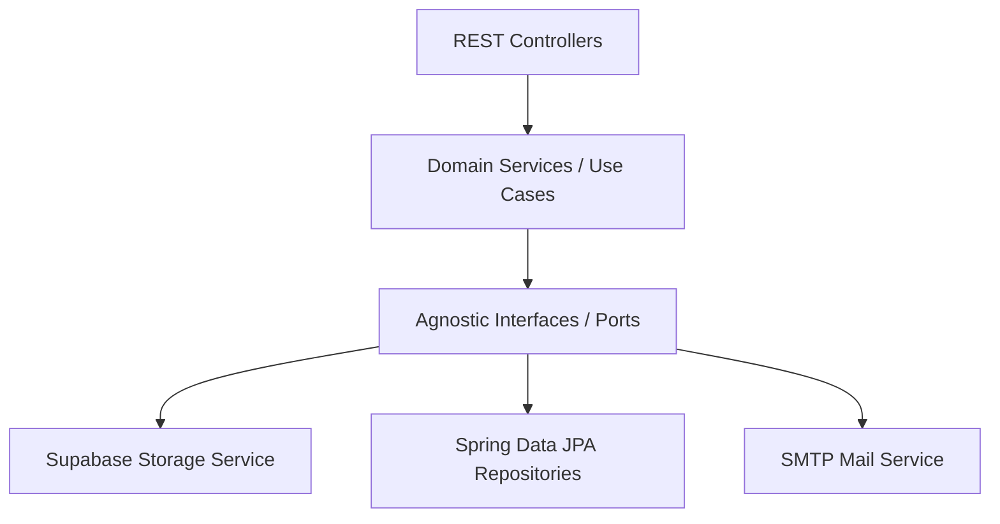

# Guía de Contribución al Proyecto - CONLAC-T Backend 🧀🥛

¡Bienvenido al equipo de desarrollo del backend de **CONLAC-T**! 

Este proyecto se desarrolla en la **Universidad Técnica de Ambato (UTA)** — Facultad de Ingeniería en Sistemas, Electrónica e Industrial (FISEI) — Carrera de Software.

El objetivo de esta guía es mantener un estándar de calidad homogéneo, profesional, legible y escalable en todo el código del backend a lo largo de los diferentes Sprints.

---

## 📌 Tabla de Contenidos
1. [Flujo de Trabajo con Git (Git Flow)](#1-flujo-de-trabajo-con-git-git-flow)
2. [Convenciones de Commits (Conventional Commits)](#2-convenciones-de-commits)
3. [Estándares de Código y Nomenclatura](#3-estándares-de-código-y-nomenclatura)
4. [Principios Arquitectónicos y Buenas Prácticas](#4-principios-arquitectónicos-y-buenas-prácticas)
5. [Manejo de Excepciones y Respuestas HTTP](#5-manejo-de-excepciones-y-respuestas-http)
6. [Pruebas Automatizadas (Testing & QA)](#6-pruebas-automatizadas-testing--qa)
7. [Gestión de Secretos y Variables de Entorno](#7-gestión-de-secretos-y-variables-de-entorno)
8. [Checklist antes de solicitar Pull Request](#8-checklist-antes-de-solicitar-pull-request)

---

## 1. Flujo de Trabajo con Git (Git Flow)

Para evitar colisiones y pérdida de trabajo, el equipo trabaja bajo ramas cortas basadas en tareas:

- **`main`**: Rama protegida. Contiene únicamente código estable, compilable y probado que corresponde a entregas de Sprint aprobadas.
- **`develop`**: Rama de integración del equipo (si aplica para el Sprint).
- **Ramas de Funcionalidad (`feature/`)**: Toda nueva tarea del Sprint debe desarrollarse en su propia rama:
  - Formato: `feature/BE-<NÚMERO_TAREA>-<descripcion-corta>`
  - Ejemplos: 
    - `feature/BE-12-crud-associations`
    - `feature/BE-13-testimonials-upload`
- **Ramas de Corrección (`fix/` o `hotfix/`)**:
  - Formato: `fix/BE-<NÚMERO_TAREA>-<descripcion-del-bug>`
  - Ejemplo: `fix/BE-14-fix-jwt-claims-parsing`

---

## 2. Convenciones de Commits

Utilizamos el estándar **Conventional Commits** en inglés o español técnico, manteniendo mensajes concisos y atómicos:

| Prefijo | Propósito | Ejemplo |
| :--- | :--- | :--- |
| `feat:` | Una nueva funcionalidad para el usuario o API | `feat: add CRUD endpoints for community associations` |
| `fix:` | Corrección de un defecto o bug | `fix: resolve cors origin mismatch on login preflight` |
| `refactor:` | Modificación interna que no cambia el comportamiento ni arregla un bug | `refactor: extract storage logic into agnostic IStorage interface` |
| `test:` | Adición o corrección de pruebas unitarias o de integración | `test: add live integration tests for supabase storage` |
| `docs:` | Cambios exclusivos en documentación | `docs: add environment setup runbook to README.md` |
| `chore:` | Tareas de mantenimiento, dependencias o configuración | `chore: upgrade postgresql driver to version 42.7.2` |

---

## 3. Estándares de Código y Nomenclatura

### 3.1. Política de Idiomas (Language Policy)
- **Código Técnico (100% Inglés):** 
  - Nombres de clases, interfaces, métodos, variables, parámetros, DTOs y pruebas deben estar en **inglés**.
  - *Correcto:* `findProductBySlug()`, `isActive`, `InventoryReservationService`.
  - *Incorrecto:* `buscarProductoPorSlug()`, `estaActivo`, `ServicioReservaInventario`.
- **Negocio y Respuestas al Usuario (Español):** 
  - Mensajes de error en excepciones para el cliente, logs de auditoría comercial y términos gastronómicos/culturales autóctonos se mantienen en **español**.
  - *Ejemplo:* `"El producto no cuenta con stock disponible"`, `"queso-fresco-artesanal"`.

### 3.2. Reglas de Capitalización
| Elemento | Convención | Ejemplo |
| :--- | :--- | :--- |
| **Clases, Interfaces, Records, Enums** | `PascalCase` | `ProductService`, `IStorage`, `UserRole` |
| **Métodos y Funciones** | `camelCase` (verbos claros) | `uploadProductImage()`, `calculateOrderTotal()` |
| **Variables y Parámetros** | `camelCase` | `associationId`, `shortDescription` |
| **Constantes y Valores Enum** | `UPPER_SNAKE_CASE` | `MAX_FILE_SIZE_BYTES`, `ACTIVE`, `PENDING_REVIEW` |
| **Tablas y Columnas SQL** | `snake_case` | `product_variants`, `arcsa_registration` |
| **Rutas REST API** | `kebab-case` en plural | `/api/associations`, `/api/payment-proofs` |

### 3.3. DTOs y Separación de Capas
- **Nunca exponer Entidades JPA (`@Entity`) directamente en los Controllers**. 
- Todas las entradas y salidas de la API deben viajar a través de **DTOs** o **Records** inmutables:
  - Peticiones: `AssociationCreateRequest`, `ProductUpdateRequest`.
  - Respuestas: `AssociationResponse`, `ProductDetailResponse`.

---

## 4. Principios Arquitectónicos y Buenas Prácticas

El backend está concebido bajo **Arquitectura Limpia / Hexagonal (Ports & Adapters)** y principios **SOLID**:



### 4.1. Principio de Responsabilidad Única (SRP)
- **Los Controllers NO contienen lógica de negocio ni consultas directas**: Su única función es recibir la petición HTTP, validar los DTOs (`@Valid`), invocar al servicio y retornar el `ResponseEntity`.
- **La lógica de negocio reside exclusivamente en la capa `service`**.

### 4.2. Principio de Abierto / Cerrado (OCP) e Inversión de Dependencias (DIP)
- Depende siempre de abstracciones/interfaces, nunca de implementaciones concretas de proveedores cloud o librerías externas.
- **Ejemplo Almacenamiento:** Inyecta siempre el contrato [`IStorage`](src/main/java/com/conlact/conlact_backend/storage/IStorage.java), **NUNCA** inyectes directamente `SupabaseStorageService` en tus controladores o servicios de productos. De este modo, si en el futuro se migra a AWS S3 o Cloudinary, no se modificará ninguna línea de negocio.

### 4.3. Inyección de Dependencias
- Utiliza **inyección por constructor** (recomendado mediante la anotación `@RequiredArgsConstructor` de Lombok con atributos `private final`).
- **Prohibido el uso de `@Autowired` en atributos privados** (field injection) en código de producción, ya que dificulta las pruebas unitarias.

---

## 5. Manejo de Excepciones y Respuestas HTTP

1. **Uso de Excepciones Semánticas:**
   - Lanza excepciones descriptivas que extiendan de `RuntimeException` (ej. `ResourceNotFoundException`, `BadRequestException`, `StorageException`).
2. **Prohibido Silenciar Errores:**
   - Queda estrictamente prohibido usar bloques `try-catch` vacíos o que solo impriman `e.printStackTrace()`.
3. **Manejador Global (`GlobalExceptionHandler`):**
   - Todos los errores son capturados centralizadamente en [`GlobalExceptionHandler.java`](src/main/java/com/conlact/conlact_backend/exception/GlobalExceptionHandler.java) retornando una estructura JSON homogénea con código HTTP adecuado:
     - `400 Bad Request`: Validaciones de entrada (`@NotNull`, `@NotBlank`, etc.).
     - `401 Unauthorized`: Token JWT ausente o inválido.
     - `403 Forbidden`: Usuario sin permisos suficientes para el recurso.
     - `404 Not Found`: Recurso no encontrado por UUID o slug.
     - `409 Conflict`: Violación de unicidad (slug duplicado, correo en uso).
     - `500 Internal Server Error`: Fallos no controlados del servidor.

---

## 6. Pruebas Automatizadas (Testing & QA)

Todo nuevo requerimiento debe incluir su correspondiente suite de pruebas antes de ser integrado a `main`:

1. **Pruebas Unitarias:**
   - Ubicadas en `src/test/java/`.
   - Utilizan **JUnit 5** y **Mockito** para probar la lógica de los servicios aislando los repositorios.
2. **Pruebas de Integración con Base de Datos:**
   - Si una prueba necesita interactuar con la base de datos PostgreSQL, debe extender de [`BaseIntegrationTest`](src/test/java/com/conlact/conlact_backend/BaseIntegrationTest.java) para ejecutarse sobre el contenedor efímero de **Testcontainers**.
   - Se debe utilizar la anotación `@DisplayName` en español explicando con precisión qué comportamiento se está verificando:
     ```java
     @Test
     @DisplayName("Debe registrar una nueva asociación y generar su slug correctamente")
     void shouldCreateAssociationAndGenerateSlug() { ... }
     ```
3. **Comprobación Local Obligatoria:**
   - Antes de subir tus cambios a GitHub, ejecuta en tu terminal:
     ```bash
     ./mvnw test
     ```
   - La compilación y los tests deben finalizar en **`BUILD SUCCESS` (0 errores, 0 fallos)**.

---

## 7. Gestión de Secretos y Variables de Entorno

- **NUNCA subas credenciales reales a GitHub:**
  - El archivo `.env` está expresamente ignorado en `.gitignore`.
  - Si agregas una nueva variable de configuración en `application.properties`, estás obligado a documentarla en [`.env.example`](.env.example) con un valor de ejemplo ficticio.
- **Valores por Defecto Seguros:**
  - Toda propiedad inyectada con `@Value("${MI_VARIABLE:valor_defecto}")` debe contar con un fallback para que la aplicación no colapse si la variable no está definida.

---

## 8. Checklist antes de solicitar Pull Request

Antes de crear un Pull Request hacia la rama principal, verifica la siguiente lista de control:

- [ ] ¿El código compila limpiamente (`./mvnw clean compile`)?
- [ ] ¿Todas las pruebas pasan al 100% (`./mvnw test`)?
- [ ] ¿Los nombres de clases, métodos y variables están en **inglés** y siguen `camelCase` / `PascalCase`?
- [ ] ¿No se modificó ni se versionó accidentalmente el archivo `.env` (`git status`)?
- [ ] ¿Los endpoints nuevos fueron probados y devuelven DTOs en lugar de entidades `@Entity` directas?
- [ ] ¿Se programó contra interfaces (`IStorage`, etc.) respetando el principio Open/Closed?
- [ ] ¿Se agregaron las pruebas unitarias o de integración correspondientes para la nueva funcionalidad?

---

¡Gracias por contribuir a mantener el código de **CONLAC-T** con la máxima calidad y profesionalismo! 🚀
