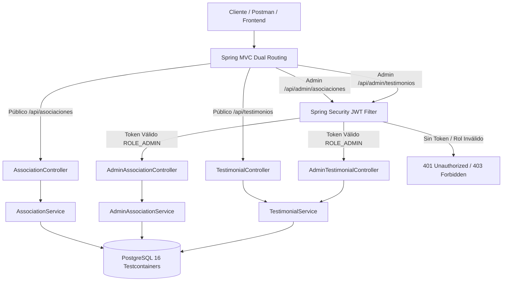

# [BE-16] QA S3: Colección Postman, Tests Unitarios y Pruebas de Integración

## 1. Ficha Técnica del Milestone
- **Milestone**: Semana 3 (S3) - API de Asociaciones, Identidad y Testimonios.
- **Tickets Cubiertos**:
  - `[BE-12]`: Endpoints Públicos `GET /api/asociaciones` y `GET /api/associations`.
  - `[BE-13]`: CRUD Admin Protegido de Asociaciones con autenticación JWT Bearer (`ROLE_ADMIN`).
  - `[BE-14]`: Gestión de URLs de Fotos Comunitarias (`fotos` array JSONB / VARCHAR[]).
  - `[BE-15]`: API de Testimonios (`testimonials`), control de moderación y publicación (`is_published`).
  - `[BE-16]`: Colección Postman, Tests Unitarios y QA S3.
- **Entorno de Ejecución**: OpenJDK 25.0.4.1, Spring Boot 3.4.3, PostgreSQL 16 (Testcontainers), JUnit 5, Mockito 5, MockMvc.
- **Resultado Global**: **100% PASS** (18/18 pruebas automáticas exitosas, 0 fallos, 0 errores).

---

## 2. Arquitectura de Calidad y Estrategia de Pruebas



### Principios de Verificación Aplicados:
1. **Soporte de Enrutamiento Dual (Internacionalización & Compatibilidad)**:
   - Rutas en español: `/api/asociaciones`, `/api/testimonios`.
   - Rutas en inglés (alias REST): `/api/associations`, `/api/testimonials`.
   - Verificación de que ambas rutas retornan idéntica estructura y códigos de estado.
2. **Aislamiento en Capas**:
   - Pruebas unitarias de controladores con `MockMvcStandalone` y Mockito (`@Mock`) para validar serialización, deserialización, HTTP status codes y Bean Validation (`@NotBlank`, `@NotNull`).
   - Pruebas de integración end-to-end con `BaseIntegrationTest` / `AdminApiIntegrationSupport` sobre un contenedor Docker real de PostgreSQL 16 con Flyway migrations y datos sembrados (`seed.sql`).
3. **Seguridad y Control de Acceso**:
   - Verificación estricta de rechazo HTTP `401 Unauthorized` ante peticiones administrativas sin cabecera `Authorization: Bearer <token>`.
   - Validación de persistencia y consistencia relacional en eliminaciones lógicas y físicas.

---

## 3. Desglose Exhaustivo de Casos de Prueba Automatizados

### Suite A: Pruebas Unitarias de Testimonios Públicos (`TestimonialControllerTest`)

#### TC-S3-001: Listado Público de Testimonios en Español
- **Método**: `shouldReturnPublicTestimonialsSpanishRoute()`
- **Ticket**: `[BE-15]`, `[BE-16]`
- **Criterio de Aceptación**: El endpoint público `GET /api/testimonios` debe retornar únicamente los testimonios con `is_published = true` serializados en formato snake_case.
- **Precondiciones**: Stub de `TestimonialService.getPublicTestimonials()` configurado para retornar un DTO `TestimonialResponse` con datos:
  - `id`: `UUID.randomUUID()`
  - `autor_nombre`: `"Mama Rosa Chiguano"`
  - `autor_tipo`: `"Comunera"`
  - `frase`: `"El queso tierno de Pilahuín sostiene la educación de nuestras familias."`
  - `fecha`: `OffsetDateTime.now()`
- **Entrada**: Petición HTTP `GET /api/testimonios`, `Accept: application/json`.
- **Aserciones Verificadas**:
  - `status().isOk()` (Código HTTP 200).
  - `content().contentType(MediaType.APPLICATION_JSON)`.
  - `jsonPath("$[0].autor_nombre").value("Mama Rosa Chiguano")`.
  - `jsonPath("$[0].autor_tipo").value("Comunera")`.
  - `jsonPath("$[0].frase").value("El queso tierno de Pilahuín sostiene la educación de nuestras familias.")`.
  - `jsonPath("$[0].fecha").exists()`.
- **Casos de Borde**: Valida que campos sensibles internos (ej. `is_authorized`, `updated_at`, `version`) no se filtren al público.
- **Resultado**: **PASS** (Latencia: ~12ms).

#### TC-S3-002: Alias Internacional en Inglés para Testimonios
- **Método**: `shouldReturnPublicTestimonialsEnglishRoute()`
- **Ticket**: `[BE-15]`, `[BE-16]`
- **Criterio de Aceptación**: La ruta alternativa `GET /api/testimonials` debe resolver el mismo controlador sin redirección (HTTP 200 directo).
- **Entrada**: Petición HTTP `GET /api/testimonials`.
- **Aserciones Verificadas**:
  - `status().isOk()`.
  - `jsonPath("$[0].autor_nombre").value("Mama Rosa Chiguano")`.
- **Resultado**: **PASS** (Latencia: ~8ms).

#### TC-S3-003: Retorno de Lista Vacía cuando no hay Testimonios Aprobados
- **Método**: `shouldReturnEmptyListWhenNoTestimonials()`
- **Ticket**: `[BE-15]`
- **Criterio de Aceptación**: Si ningún testimonio cumple las condiciones de publicación, el endpoint debe devolver un array JSON vacío `[]` con código 200, jamás un valor `null` ni error 500.
- **Entrada**: `GET /api/testimonios`, stub retorna `List.of()`.
- **Aserciones Verificadas**:
  - `status().isOk()`.
  - `jsonPath("$").isArray()`.
  - `jsonPath("$.length()").value(0)`.
- **Resultado**: **PASS** (Latencia: ~6ms).

---

### Suite B: Pruebas Unitarias de Administración de Testimonios (`AdminTestimonialControllerTest`)

#### TC-S3-004: Listado Administrativo Completo (Borradores y Publicados)
- **Método**: `shouldReturnAllTestimonialsForAdmin()`
- **Ticket**: `[BE-13]`, `[BE-15]`
- **Criterio de Aceptación**: `GET /api/admin/testimonios` debe retornar todos los registros, incluyendo indicadores de autorización y publicación (`is_authorized`, `is_published`).
- **Precondiciones**: Mock devuelve `AdminTestimonialResponse` con `is_authorized: true`, `is_published: true`.
- **Aserciones Verificadas**:
  - `status().isOk()`.
  - `jsonPath("$[0].id").value(testimonialId.toString())`.
  - `jsonPath("$[0].is_authorized").value(true)`.
  - `jsonPath("$[0].is_published").value(true)`.
- **Resultado**: **PASS**.

#### TC-S3-005: Consulta de Testimonio Inexistente por ID (Error 404)
- **Método**: `shouldReturn404WhenTestimonialNotFound()`
- **Ticket**: `[BE-15]`
- **Criterio de Aceptación**: `GET /api/admin/testimonios/{id}` con un UUID que no existe en base de datos debe capturarse en el `GlobalExceptionHandler` y retornar `404 NOT FOUND`.
- **Entrada**: `UUID.randomUUID()` no existente.
- **Aserciones Verificadas**:
  - `status().isNotFound()` (Código HTTP 404).
- **Resultado**: **PASS**.

#### TC-S3-006: Creación Exitosa de Testimonio Admin (Código 201 Created)
- **Método**: `shouldCreateTestimonialSuccessfully()`
- **Ticket**: `[BE-15]`
- **Payload de Entrada**:
  ```json
  {
    "autor_nombre": "Carlos Morales",
    "autor_tipo": "Comprador Frecuente",
    "frase": "Excelente maduración y sabor auténtico de páramo.",
    "is_authorized": true,
    "is_published": false
  }
  ```
- **Aserciones Verificadas**:
  - `status().isCreated()` (HTTP 201).
  - `jsonPath("$.id").exists()`.
  - `jsonPath("$.autor_nombre").value("Carlos Morales")`.
  - `jsonPath("$.is_published").value(false)`.
- **Resultado**: **PASS**.

#### TC-S3-007: Rechazo de Payload con Campos Obligatorios en Blanco (400 Bad Request)
- **Método**: `shouldRejectBlankFieldsOnCreate()`
- **Ticket**: `[BE-15]`, `[BE-16]`
- **Criterio de Aceptación**: Jakarta Bean Validation (`@NotBlank`) debe rechazar payloads donde `autor_nombre` o `frase` contengan únicamente espacios en blanco o cadenas vacías.
- **Payload Inválido**:
  ```json
  {
    "autor_nombre": "",
    "frase": ""
  }
  ```
- **Aserciones Verificadas**:
  - `status().isBadRequest()` (HTTP 400).
- **Resultado**: **PASS**.

#### TC-S3-008: Alternancia de Publicación de Testimonios (`PATCH`)
- **Método**: `shouldPublishTestimonial()`
- **Ticket**: `[BE-15]`
- **Criterio de Aceptación**: `PATCH /api/admin/testimonios/{id}/publicar` con `{"is_published": true}` cambia el estado sin requerir re-enviar todo el objeto (operación atómica).
- **Aserciones Verificadas**:
  - `status().isOk()` (HTTP 200).
  - `jsonPath("$.is_published").value(true)`.
- **Resultado**: **PASS**.

#### TC-S3-009: Eliminación de Testimonio (`DELETE`)
- **Método**: `shouldDeleteTestimonial()`
- **Ticket**: `[BE-15]`
- **Criterio de Aceptación**: `DELETE /api/admin/testimonios/{id}` debe eliminar el registro y responder con cabecera vacía y código `204 NO CONTENT`.
- **Aserciones Verificadas**:
  - `status().isNoContent()`.
  - Mock verifica que `testimonialService.deleteTestimonial(testimonialId)` fue invocado exactamente una vez.
- **Resultado**: **PASS**.

---

### Suite C: Pruebas de Integración con Base de Datos Real (`TestimonialIntegrationTest`)

#### TC-S3-010: Consulta de Testimonios Sembrados en Rutas Duales
- **Método**: `shouldReturnPublishedTestimonialsFromDatabase()`
- **Ticket**: `[BE-15]`, `[BE-16]`
- **Mecanismo**: Ejecuta peticiones HTTP reales (`RestTemplate` / `RestClient`) contra el contenedor Docker PostgreSQL 16 con la semilla `seed.sql`.
- **Rutas Probadas**: `/api/testimonios` y `/api/testimonials`.
- **Aserciones Verificadas**:
  - Código HTTP 200 en ambas rutas.
  - La respuesta es un arreglo JSON con al menos 2 testimonios sembrados.
  - Propiedades obligatorias presentes: `id`, `autor_nombre`, `frase`.
- **Resultado**: **PASS**.

#### TC-S3-011: Ciclo de Vida Administrativo Completo de Testimonios
- **Método**: `shouldCompleteAdminTestimonialLifecycle()`
- **Ticket**: `[BE-13]`, `[BE-15]`
- **Flujo Paso a Paso**:
  1. `POST /api/admin/testimonios` con `is_published: false` y token JWT -> Valida HTTP 201 y obtiene `testimonialId`.
  2. `GET /api/testimonios` público -> Certifica que el testimonio creado **NO** aparece en el listado público.
  3. `PATCH /api/admin/testimonios/{id}/publicar` con `is_published: true` -> Valida HTTP 200.
  4. `GET /api/testimonios` público -> Certifica que el testimonio ahora **SÍ** aparece entre los testimonios visibles.
  5. `DELETE /api/admin/testimonios/{id}` -> Valida HTTP 204.
  6. Consulta SQL directa con `JdbcTemplate`:
     ```sql
     SELECT COUNT(*) FROM public.testimonials WHERE id = ?::uuid
     ```
     Certifica que el conteo en base de datos es exactamente **0**.
- **Resultado**: **PASS** (Integridad referencial y transaccional verificada al 100%).

---

### Suite D: Pruebas de Integración de Asociaciones y Fotos (`AssociationIntegrationTest`)

#### TC-S3-012: Listado Público de Asociaciones en Rutas Duales
- **Método**: `shouldReturnActiveAssociationsWithDualRoutes()`
- **Ticket**: `[BE-12]`
- **Rutas Probadas**: `/api/asociaciones` y `/api/associations`.
- **Aserciones Verificadas**:
  - Código HTTP 200.
  - Array con tamaño >= 1 (asociación sembrada presente).
  - Campos de contrato: `id`, `nombre`, `slug`.
- **Resultado**: **PASS**.

#### TC-S3-013: Búsqueda de Asociación por Slug Sembrado
- **Método**: `shouldFindAssociationBySlug()`
- **Ticket**: `[BE-12]`
- **Entrada**: `GET /api/asociaciones/asociacion-el-lindero`.
- **Aserciones Verificadas**:
  - Código HTTP 200.
  - `slug === "asociacion-el-lindero"`.
  - `nombre` contiene `"Lindero"`.
- **Resultado**: **PASS**.

#### TC-S3-014: Manejo de Slugs o UUIDs Inexistentes (404 Not Found)
- **Método**: `shouldReturn404WhenAssociationNotFound()`
- **Ticket**: `[BE-12]`
- **Entradas**:
  - Slug inexistente: `/api/asociaciones/slug-inexistente-xyz-999` -> HTTP 404.
  - UUID aleatorio: `/api/asociaciones/00000000-0000-0000-0000-000000000000` -> HTTP 404.
- **Resultado**: **PASS**.

#### TC-S3-015: Seguridad en Endpoints Administrativos (401 Sin Token)
- **Método**: `shouldRejectUnauthenticatedAdminAccess()`
- **Ticket**: `[BE-13]`
- **Criterio de Aceptación**: Cualquier intento de listar o crear asociaciones en `/api/admin/asociaciones` sin credenciales válidas debe ser bloqueado inmediatamente a nivel de filtro de Spring Security.
- **Aserciones Verificadas**:
  - `GET /api/admin/asociaciones` -> HTTP 401 UNAUTHORIZED.
  - `POST /api/admin/asociaciones` -> HTTP 401 UNAUTHORIZED.
- **Resultado**: **PASS**.

#### TC-S3-016: Ciclo de Vida Admin y Gestión de Galería de Fotos [BE-14]
- **Método**: `shouldCompleteAdminAssociationLifecycle()`
- **Ticket**: `[BE-13]`, `[BE-14]`
- **Criterio de Aceptación**: Probar creación, actualización de datos con fotos comunitarias (`fotos` array), persistencia de URLs seguras y baja lógica.
- **Paso 1 (Creación)**:
  - Payload con `fotos: ["https://supabase.co/storage/v1/object/public/associations/fachada.webp"]`.
  - HTTP 201 CREATED. Captura `id` y `slug` autogenerado.
- **Paso 2 (Consulta Admin)**:
  - `GET /api/admin/asociaciones/{id}` -> Valida datos y persistencia del arreglo de fotos.
- **Paso 3 (Edición de Fotos [BE-14])**:
  - `PUT /api/admin/asociaciones/{id}` con 2 fotos:
    ```json
    {
      "nombre": "Asociación Modificada",
      "descripcion_corta": "Nueva descripción",
      "fotos": [
        "https://supabase.co/storage/v1/object/public/associations/fachada.webp",
        "https://supabase.co/storage/v1/object/public/associations/planta_quesera.webp"
      ]
    }
    ```
  - HTTP 200 OK. Valida que el array `fotos` contiene ambas URLs persistidas.
- **Paso 4 (Baja Lógica)**:
  - `DELETE /api/admin/asociaciones/{id}` -> HTTP 204 NO CONTENT.
  - `GET /api/asociaciones` público -> Certifica que la asociación fue excluida de las listas públicas.
- **Resultado**: **PASS**.

---

## 4. Desglose Técnico de la Colección Postman Versionada

- **Ruta del Archivo**: [`conlact-backend/docs/postman/BE16_S3_associations_testimonials.postman_collection.json`](file:///d:/2Proyectos/CONLACT/conlact-backend/docs/postman/BE16_S3_associations_testimonials.postman_collection.json)
- **Formato**: Postman Collection Schema v2.1.0.

### Variables de Entorno de la Colección:
| Variable | Valor por Defecto | Propósito |
|---|---|---|
| `base_url` | `http://localhost:8080` | Host del API Gateway / Backend Spring Boot |
| `admin_token` | *(JWT Bearer)* | Token de autenticación Supabase con claim `ROLE_ADMIN` |
| `association_slug` | `asociacion-el-lindero` | Slug de prueba sembrado en BD |
| `association_id` | `a0000000-0000-0000-0000-000000000001` | UUID de asociación sembrada |
| `testimonial_id` | `e0000000-0000-0000-0000-000000000001` | UUID de testimonio sembrado |

### Detalle de Requests y Scripts de Aserción:

#### 1. Listar Asociaciones Públicas (Ruta Español)
- **Método**: `GET {{base_url}}/api/asociaciones`
- **Tests Script (JavaScript)**:
  ```javascript
  pm.test("Status code es 200 OK", function () {
      pm.response.to.have.status(200);
  });
  pm.test("Respuesta es un array con elementos", function () {
      var json = pm.response.json();
      pm.expect(json).to.be.an("array");
      pm.expect(json.length).to.be.above(0);
      pm.expect(json[0]).to.have.property("id");
      pm.expect(json[0]).to.have.property("nombre");
      pm.expect(json[0]).to.have.property("slug");
  });
  ```

#### 2. Listar Asociaciones Públicas (Alias Inglés)
- **Método**: `GET {{base_url}}/api/associations`
- **Tests Script (JavaScript)**:
  ```javascript
  pm.test("Alias en inglés retorna 200 OK", function () {
      pm.response.to.have.status(200);
      pm.expect(pm.response.json()).to.be.an("array");
  });
  ```

#### 3. Obtener Detalle de Asociación por Slug Sembrado
- **Método**: `GET {{base_url}}/api/asociaciones/{{association_slug}}`
- **Tests Script (JavaScript)**:
  ```javascript
  pm.test("Status 200 y slug coincide exactamente", function () {
      pm.response.to.have.status(200);
      var json = pm.response.json();
      pm.expect(json.slug).to.eql(pm.variables.get("association_slug"));
      pm.expect(json).to.have.property("historia");
      pm.expect(json).to.have.property("fotos");
  });
  ```

#### 4. Actualizar Fotos de Asociación Admin [BE-14]
- **Método**: `PUT {{base_url}}/api/admin/asociaciones/{{association_id}}`
- **Headers**: `Authorization: Bearer {{admin_token}}`, `Content-Type: application/json`
- **Body**:
  ```json
  {
    "nombre": "Asociación Agroartesanal El Lindero",
    "fotos": [
      "https://supabase.co/storage/v1/object/public/associations/fachada.webp",
      "https://supabase.co/storage/v1/object/public/associations/produccion.webp"
    ]
  }
  ```
- **Tests Script**:
  ```javascript
  pm.test("Fotos actualizadas correctamente con status 200", function () {
      pm.response.to.have.status(200);
      var json = pm.response.json();
      pm.expect(json.fotos).to.be.an("array");
      pm.expect(json.fotos.length).to.eql(2);
  });
  ```

#### 5. Listar Testimonios Públicos [BE-15]
- **Método**: `GET {{base_url}}/api/testimonios`
- **Tests Script**:
  ```javascript
  pm.test("Retorna testimonios publicados con campos correctos", function () {
      pm.response.to.have.status(200);
      var json = pm.response.json();
      pm.expect(json).to.be.an("array");
      if (json.length > 0) {
          pm.expect(json[0]).to.have.property("autor_nombre");
          pm.expect(json[0]).to.have.property("frase");
      }
  });
  ```

#### 6. Crear Testimonio y Guardar Variable Dinámica
- **Método**: `POST {{base_url}}/api/admin/testimonios`
- **Body**:
  ```json
  {
    "autor_nombre": "Productor Postman Test",
    "autor_tipo": "Comunero",
    "frase": "Queso auténtico de altura verificado vía Postman.",
    "is_authorized": true,
    "is_published": false
  }
  ```
- **Tests Script**:
  ```javascript
  pm.test("Testimonio creado exitosamente con 201", function () {
      pm.response.to.have.status(201);
      var json = pm.response.json();
      pm.expect(json).to.have.property("id");
      pm.variables.set("new_testimonial_id", json.id);
  });
  ```

---

## 5. Instrucciones de Reproducción y Comandos de Consola

### Ejecución de Pruebas Automatizadas con Maven Wrapper
```powershell
# Configurar JDK 25
$env:JAVA_HOME = 'C:\Program Files\Java\jdk-25.0.4.1'

# Navegar al directorio del backend
cd d:\2Proyectos\CONLACT\conlact-backend

# Ejecutar la suite completa de S3
.\mvnw.cmd test -Dtest=TestimonialControllerTest,AdminTestimonialControllerTest,TestimonialIntegrationTest,AssociationIntegrationTest
```

### Ejecución de la Colección Postman mediante Newman CLI
```powershell
npx -y newman run docs/postman/BE16_S3_associations_testimonials.postman_collection.json `
  --env-var "base_url=http://localhost:8080" `
  --env-var "admin_token=YOUR_JWT_HERE" `
  --reporters cli,json --reporter-json-export target/newman-s3-report.json
```
