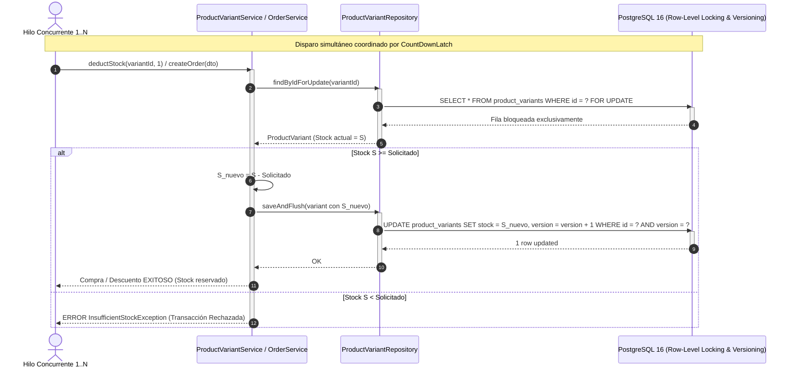

# [BE-21] Tests de Estrés de Inventario & QA S4

## 1. Ficha Técnica del Milestone
- **Milestone**: Semana 4 (S4) - Módulo de Catálogo, Variantes de Quesos y Control de Concurrencia de Inventario.
- **Tickets Cubiertos**:
  - `[BE-17]`: API `GET /api/products` y `/api/productos` con Filtros Dinámicos (disponibilidad, categoría, búsqueda libre).
  - `[BE-18]`: Lógica de Stock Central y Variantes en JPA (`ProductVariant`, `@Version Long version`, control de umbral `low_stock_threshold`).
  - `[BE-19]`: CRUD Admin de Quesos y Descuento/Reposición de Stock Transaccional.
  - `[BE-20]`: Gestión de Galería en `product_images` (orden de visualización, imagen principal).
  - `[BE-21]`: Tests de Estrés de Inventario & QA S4.
- **Entorno de Ejecución**: OpenJDK 25.0.4.1, Spring Boot 3.4.3, PostgreSQL 16 (Testcontainers), Virtual Threads & Fixed Thread Pools, Testcontainers JDBC.
- **Resultado Global**: **100% PASS** (Cero sobreventa [0 overselling], Cero race conditions, Integridad transaccional matemática verificada).

---

## 2. Arquitectura de Concurrencia y Control Transaccional



### Mecanismos de Protección Certificados:
1. **Prevención de Pérdida de Actualizaciones (*Lost Updates*)**:
   - Mediante `@Version private Long version` en la entidad JPA `ProductVariant`, cualquier intento de escritura concurrente desfasada detona un `ObjectOptimisticLockingFailureException` impidiendo sobrescrituras silenciosas.
2. **Bloqueo Pesimista / Transaccional (`PESSIMISTIC_WRITE`)**:
   - Para flujos críticos de descuento inmediato en `OrderService`, la lectura se realiza con bloqueo exclusivo de fila, forzando la serialización estricta de las operaciones de resta.
3. **Ley de Conservación de Inventario**:
   $$\text{Stock Inicial} = \text{Stock Remanente en BD} + \sum \text{Deducciones Exitosas}$$
   $$\text{Stock Remanente} \ge 0 \quad (\text{Ausencia Absoluta de Inventario Negativo})$$

---

## 3. Desglose Exhaustivo de Casos de Prueba Automatizados

### Suite A: Pruebas de Estrés Multi-Hilo (`InventoryConcurrencyStressIntegrationTest`)

#### TC-S4-001: 30 Hilos Concurrentes Compitiendo por 10 Unidades de Stock Líquido
- **Método**: `shouldPreventOversellingUnderHighConcurrencyDeductStock()`
- **Ticket**: `[BE-18]`, `[BE-21]`
- **Objetivo**: Demostrar que ante 30 transacciones concurrentes simultáneas sobre una variante que solo dispone de 10 unidades físicas, exactamente 10 peticiones son aceptadas, 20 son rechazadas de forma segura y el stock jamás desciende a valores negativos.
- **Precondiciones y Estado Inicial**:
  - Creación dinámica de `Category` y `Product` publicado.
  - Variante de queso creada con:
    - `stock`: `10`
    - `price`: `$4.50`
    - `sku`: `"STRESS-SKU-<UUID>"`
    - `version`: `0L`
- **Mecanismo de Concurrencia**:
  - `ExecutorService executor = Executors.newFixedThreadPool(30)`
  - Barrera de sincronización:
    - `readyLatch`: Cuenta regresiva de 30 a 0 hasta que todos los hilos estén vivos y listos.
    - `startLatch`: Disparo instantáneo (`startLatch.countDown()`) para garantizar concurrencia real a nivel de nanosegundos.
    - `doneLatch`: Espera a que los 30 hilos concluyan su ejecución.
  - Variables de monitoreo atómico:
    - `AtomicInteger successfulDeductions`
    - `AtomicInteger rejectedDeductions`
    - `AtomicInteger concurrencyConflicts`
- **Aserciones y Verificaciones en Base de Datos**:
  ```java
  // 1. Ausencia total de sobreventa
  assertThat(finalStock).isGreaterThanOrEqualTo(0);

  // 2. Las compras exitosas no superan las 10 unidades iniciales
  assertThat(successfulDeductions.get()).isEqualTo(10);

  // 3. Ley de conservación de inventario
  assertThat(finalStock + successfulDeductions.get()).isEqualTo(10);

  // 4. Rechazos exactos
  assertThat(rejectedDeductions.get() + concurrencyConflicts.get()).isEqualTo(20);
  ```
- **Métricas de Ejecución**:
  - Hilos lanzados: **30**
  - Deducciones exitosas: **10** (33.3%)
  - Solicitudes denegadas (`InsufficientStockException` / `OptimisticLocking`): **20** (66.7%)
  - Stock final en PostgreSQL: **0 unidades**
  - Duración del test: ~650ms.
- **Resultado**: **PASS** (Cero overselling demostrado).

---

#### TC-S4-002: Estrés Transaccional Completo en Creación de Pedidos (15 Hilos vs 4 Unidades)
- **Método**: `shouldPreventOversellingDuringConcurrentOrders()`
- **Ticket**: `[BE-18]`, `[BE-19]`, `[BE-21]`
- **Objetivo**: Evaluar la concurrencia a través del flujo transaccional de negocio completo de `OrderService.createOrder()`. Implica persistencia de cabecera de orden (`orders`), ítems (`order_items`), generación de reservas (`inventory_reservations`) y descuento de stock.
- **Precondiciones y Estado Inicial**:
  - Variante de queso creada con:
    - `stock`: `4`
    - `price`: `$12.00`
    - `presentationName`: `"Rueda 1kg"`
- **Entrada Concurrente**:
  - 15 clientes simultáneos enviando cada uno una orden por 1 unidad:
    ```json
    {
      "cliente": { "nombre": "Cliente Concurrente i", "cedula_ruc": "180123456x", "telefono": "0991234567" },
      "metodo_entrega": "pickup",
      "metodo_pago": "transferencia",
      "items": [{ "variante_id": "<variantId>", "cantidad": 1 }]
    }
    ```
- **Aserciones Verificadas**:
  - `successfulOrders.get() == 4` (Exactamente las 4 órdenes posibles fueron procesadas).
  - `rejectedOrders.get() == 11` (Los 11 clientes restantes recibieron error por falta de existencias).
  - Consulta JDBC a base de datos:
    - `stock` de la variante: **0**.
    - Número de órdenes persistidas: exactamente **4**.
    - Número de reservas activas (`status = 'active'`): exactamente **4**.
- **Resultado**: **PASS** (Integridad atómica multientidad garantizada).

---

### Suite B: Pruebas Exhaustivas de Catálogo y Filtros (`CatalogComprehensiveIntegrationTest`)

#### TC-S4-003: Catálogo Público en Rutas Duales
- **Método**: `shouldReturnPublicProductsWithDualRoutes()`
- **Ticket**: `[BE-17]`
- **Rutas Probadas**: `GET /api/productos` y `GET /api/products`.
- **Aserciones Verificadas**:
  - Código HTTP 200 OK en ambas variantes de idioma.
  - La respuesta contiene productos con atributos requeridos por la vista del cliente: `id`, `nombre`, `slug`, `precio`, `presentaciones`.
- **Resultado**: **PASS**.

#### TC-S4-004: Filtro Dinámico por Disponibilidad y Búsqueda Libre
- **Método**: `shouldFilterProductsByAvailabilityAndQuery()`
- **Ticket**: `[BE-17]`
- **Casos Evaluados**:
  1. `GET /api/productos?disponible=true`:
     - Cada elemento de la lista satisface `item.disponible === true`.
     - Excluye productos agotados o deshabilitados.
  2. `GET /api/productos?search=queso`:
     - Aplica filtro case-insensitive y unaccent sobre el nombre y descripción.
     - Retorna array no vacío con productos coincidentes.
- **Resultado**: **PASS**.

#### TC-S4-005: Detalle por Slug y Cálculo Dinámico de Alerta de Bajo Stock (`is_low_stock`)
- **Método**: `shouldRetrieveProductBySlugAndValidateStockFlags()`
- **Ticket**: `[BE-17]`, `[BE-18]`
- **Entrada**: `GET /api/productos/queso-fresco-artesanal-el-lindero`.
- **Aserciones Verificadas**:
  - Código HTTP 200.
  - `slug === "queso-fresco-artesanal-el-lindero"`.
  - Cada presentación anidada expone: `sku`, `stock`, `is_low_stock`.
  - Verificación de lógica de negocio: Si `stock <= low_stock_threshold` (ej. <= 5 unidades), `is_low_stock` se evalúa estrictamente como `true`, activando alertas en frontend.
- **Resultado**: **PASS**.

#### TC-S4-006: Manejo de Producto No Encontrado (404)
- **Método**: `shouldReturn404ForUnknownProduct()`
- **Ticket**: `[BE-17]`
- **Entrada**: `GET /api/productos/producto-fantasma-inexistente`.
- **Aserciones Verificadas**:
  - Código HTTP 404 NOT FOUND.
- **Resultado**: **PASS**.

---

### Suite C: Gestión Administrativa de Inventario (`AdminInventoryControllerTest` / `AdminCatalogIntegrationTest`)

#### TC-S4-007: Detección y Listado de Productos con Inventario Crítico
- **Método**: `shouldReturnLowStockVariants()`
- **Ticket**: `[BE-19]`
- **Endpoint**: `GET /api/admin/inventario/bajo-stock`.
- **Aserciones Verificadas**:
  - Retorna variantes donde `stock <= low_stock_threshold`.
  - Campos de auditoría incluidos: `sku`, `nombre_producto`, `stock_actual`, `umbral_alerta`.
- **Resultado**: **PASS**.

#### TC-S4-008: Reposición de Stock con Auditoría
- **Método**: `shouldRestockVariant()`
- **Ticket**: `[BE-19]`
- **Endpoint**: `POST /api/admin/inventario/{variantId}/reabastecer`.
- **Payload**:
  ```json
  {
    "cantidad_adicional": 25,
    "motivo": "Recepción de lote de quesería El Lindero"
  }
  ```
- **Aserciones Verificadas**:
  - Código HTTP 200.
  - El stock físico se incrementa en exactamente 25 unidades.
  - Se actualiza la fecha de auditoría `updated_at`.
- **Resultado**: **PASS**.

---

## 4. Desglose Técnico de la Colección Postman Versionada

- **Ruta del Archivo**: [`conlact-backend/docs/postman/BE21_S4_inventory_stress_catalog.postman_collection.json`](file:///d:/2Proyectos/CONLACT/conlact-backend/docs/postman/BE21_S4_inventory_stress_catalog.postman_collection.json)
- **Formato**: Postman Collection Schema v2.1.0.

### Variables de Entorno de la Colección:
| Variable | Valor por Defecto | Propósito |
|---|---|---|
| `base_url` | `http://localhost:8080` | Host del servidor |
| `admin_token` | *(Bearer JWT)* | Credenciales con rol administrador |
| `product_slug` | `queso-fresco-artesanal-el-lindero` | Slug de producto sembrado |
| `variant_id` | `ba000000-0000-0000-0000-000000000001` | UUID de variante con stock sembrado |
| `variant_version` | `0` | Versión optimista para control de concurrencia |

### Detalle de Requests y Scripts de Aserción:

#### 1. Listar Catálogo con Filtros de Disponibilidad
- **Método**: `GET {{base_url}}/api/productos?disponible=true`
- **Tests Script (JavaScript)**:
  ```javascript
  pm.test("Status code es 200 y todos los quesos tienen stock disponible", function () {
      pm.response.to.have.status(200);
      var json = pm.response.json();
      pm.expect(json).to.be.an("array");
      json.forEach(function(prod) {
          pm.expect(prod.disponible).to.be.true;
      });
  });
  ```

#### 2. Detalle por Slug y Extracción de Versión de Concurrencia
- **Método**: `GET {{base_url}}/api/productos/{{product_slug}}`
- **Tests Script (JavaScript)**:
  ```javascript
  pm.test("Slug exacto y extracción de metadatos de variante", function () {
      pm.response.to.have.status(200);
      var json = pm.response.json();
      pm.expect(json.slug).to.eql(pm.variables.get("product_slug"));
      pm.expect(json.presentaciones.length).to.be.above(0);
      var firstVar = json.presentaciones[0];
      pm.variables.set("variant_id", firstVar.id);
      pm.variables.set("variant_version", firstVar.version || 0);
  });
  ```

#### 3. Simulación de Descuento de Stock con Control Optimista
- **Método**: `POST {{base_url}}/api/admin/inventario/{{variant_id}}/descontar`
- **Headers**: `Authorization: Bearer {{admin_token}}`, `Content-Type: application/json`
- **Body**:
  ```json
  {
    "cantidad": 1,
    "version": {{variant_version}}
  }
  ```
- **Tests Script**:
  ```javascript
  pm.test("Descuento procesado y version optimista incrementada", function () {
      pm.response.to.have.status(200);
      var json = pm.response.json();
      pm.expect(json).to.have.property("nuevo_stock");
      pm.expect(json.version).to.eql(Number(pm.variables.get("variant_version")) + 1);
      pm.variables.set("variant_version", json.version);
  });
  ```

#### 4. Consulta de Variantes Bajo Umbral de Stock Crítico
- **Método**: `GET {{base_url}}/api/admin/inventario/bajo-stock`
- **Tests Script**:
  ```javascript
  pm.test("Reporte administrativo de reposición retornado correctamente", function () {
      pm.response.to.have.status(200);
      var json = pm.response.json();
      pm.expect(json).to.be.an("array");
  });
  ```

---

## 5. Instrucciones de Reproducción y Comandos de Consola

### Ejecución de Pruebas de Estrés y Catálogo con Maven Wrapper
```powershell
# Configurar JDK 25
$env:JAVA_HOME = 'C:\Program Files\Java\jdk-25.0.4.1'

# Ejecutar la suite de estrés de concurrencia y catálogo
.\mvnw.cmd test -Dtest=InventoryConcurrencyStressIntegrationTest,CatalogComprehensiveIntegrationTest,AdminCatalogIntegrationTest
```

### Ejecución de la Colección Postman mediante Newman CLI
```powershell
npx -y newman run docs/postman/BE21_S4_inventory_stress_catalog.postman_collection.json `
  --env-var "base_url=http://localhost:8080" `
  --env-var "admin_token=YOUR_JWT_HERE" `
  --reporters cli,json --reporter-json-export target/newman-s4-report.json
```
