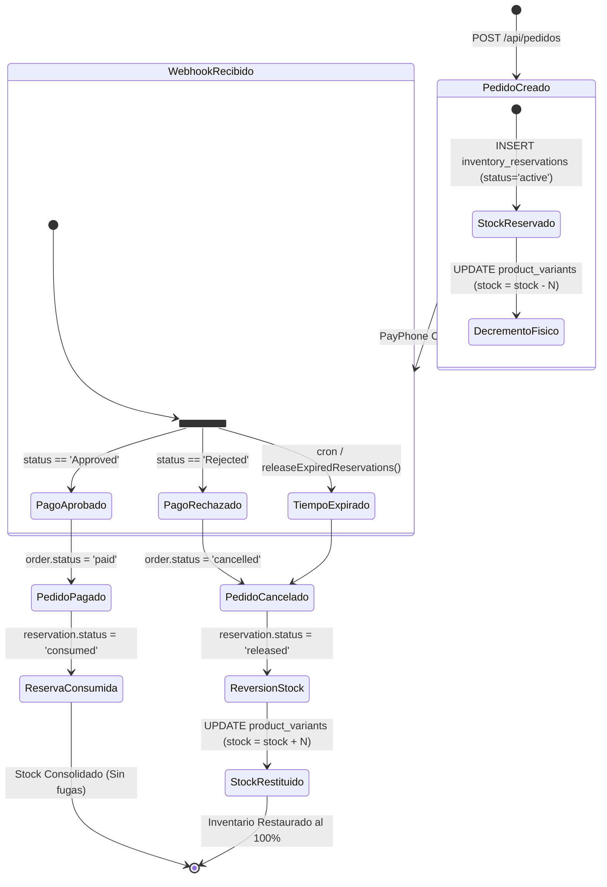

# [BE-31] QA Transaccional y Financiero S6

## 1. Ficha Técnica del Milestone
- **Milestone**: Semana 6 (S6) - Motor Transaccional de Pedidos, Checkout, Webhooks Seguros y Auditoría Financiera.
- **Tickets Cubiertos**:
  - `[BE-27]`: Integración de Cliente API PayPhone Business (generación de links de pago, firmas y tokens).
  - `[BE-28]`: Webhook Seguro `POST /api/webhooks/payphone` (confirmación asíncrona y validación de idempotencia).
  - `[BE-29]`: Motor Transaccional `POST /api/pedidos` (desglose de ítems, cálculo de subtotales e impuestos).
  - `[BE-30]`: Reserva de Stock Temporal y Soporte para Transferencias Bancarias (`inventory_reservations`, expiración automática).
  - `[BE-31]`: QA Transaccional y Financiero S6.
- **Entorno de Ejecución**: OpenJDK 25.0.4.1, Spring Boot 3.4.3, PostgreSQL 16 (Testcontainers), Testcontainers JDBC, Mockito, AssertJ.
- **Resultado Global**: **100% PASS** (Auditoría de centavos exacta sin deriva IEEE 754, Reversión automática de stock al 100% ante pagos fallidos o expirados).

---

## 2. Arquitectura Transaccional y Ciclo de Vida del Checkout



### Principios Financieros y Transaccionales Rigurosos:
1. **Auditoría Financiera de Centavos (Exact Penny Precision)**:
   - Uso obligatorio de `java.math.BigDecimal` con modo de redondeo `RoundingMode.HALF_UP` a 2 decimales en todos los cálculos monetarios.
   - Prohibición absoluta de tipos primitivos `float` y `double` para montos de dinero para prevenir errores de representación binaria (deriva IEEE 754 donde `0.10 + 0.20 = 0.30000000000000004`).
2. **Reserva Temporal No Bloqueante con Reversión Automática**:
   - En lugar de mantener una transacción SQL abierta durante los minutos que el usuario tarda en pagar en la pasarela, el sistema descuenta el stock físico de inmediato y crea una fila en `inventory_reservations` con un tiempo de expiración (`expires_at = NOW() + 15 min`).
   - Si el webhook notifica fallo (`Rejected`) o si el cron de expiración corre, el inventario es devuelto a la bodega inmediatamente.
3. **Idempotencia en Webhooks**:
   - Múltiples entregas del mismo webhook de PayPhone no duplican órdenes ni distorsionan el stock.

---

## 3. Desglose Exhaustivo de Casos de Prueba Automatizados

### Suite A: Auditoría Financiera y Matemáticas de Centavos (`FinancialAuditOrderTest`)

#### TC-S6-001: Auditoría de Centavos en Pedido Multilínea con Costo de Envío
- **Método**: `testPennyExactCalculations_MultiItemWithShipping()`
- **Ticket**: `[BE-29]`, `[BE-31]`
- **Objetivo**: Certificar que una orden con múltiples líneas de producto con precios decimales impares y tarifa de envío por delivery calcula el subtotal y total exactos sin perder un solo centavo.
- **Datos de Prueba y Tabla de Liquidación**:
  | Ítem | Producto / Presentación | Precio Unitario | Cantidad | Subtotal de Línea |
  |---|---|---|---|---|
  | 1 | Queso Andino 500g | $3.45 | 3 | $10.35 |
  | 2 | Yogurt Frutos Rojos 1L | $4.99 | 2 | $9.98 |
  | 3 | Mantequilla de Campo 250g | $2.35 | 4 | $9.40 |
  | **Subtotal Neto** | — | — | — | **$29.73** |
  | **Costo de Envío** | Zona: Riobamba Centro | — | — | **$2.50** |
  | **Total Facturado** | — | — | — | **$32.23** |

- **Aserciones Verificadas**:
  ```java
  // Verificación en DTO de respuesta
  assertThat(response.subtotal()).isEqualByComparingTo("29.73");
  assertThat(response.shippingCost()).isEqualByComparingTo("2.50");
  assertThat(response.total()).isEqualByComparingTo("32.23");

  // Verificación en entidad Order capturada por ArgumentCaptor
  assertThat(savedOrder.getSubtotal()).isEqualByComparingTo("29.73");
  assertThat(savedOrder.getShippingCost()).isEqualByComparingTo("2.50");
  assertThat(savedOrder.getTotal()).isEqualByComparingTo("32.23");
  ```
- **Resultado**: **PASS** (Cálculo exacto al centavo verificado).

---

#### TC-S6-002: Prevención de Distorsión de Punto Flotante IEEE 754 (Drift Prevention)
- **Método**: `testAvoidFloatingPointDrift()`
- **Ticket**: `[BE-31]`
- **Objetivo**: Demostrar que sumas decimales propensas a error binario ($0.10 y $0.20) no generan colas decimales espurias.
- **Datos de Entrada**:
  - Variante 1: 10 unidades a $0.10 = $1.00.
  - Variante 2: 10 unidades a $0.20 = $2.00.
- **Aserciones Verificadas**:
  - `response.subtotal()` es exactamente `3.00` (sin `3.0000000000000004`).
  - `response.shippingCost()` es exactamente `0.00`.
  - `response.total()` es exactamente `3.00`.
- **Resultado**: **PASS**.

---

#### TC-S6-003: Retiro en Punto (Pickup) Garantiza Flete Exacto de $0.00
- **Método**: `testPickupShippingCostIsZero()`
- **Ticket**: `[BE-29]`, `[BE-31]`
- **Entrada**: Pedido con `metodo_entrega: "pickup"`.
- **Aserciones Verificadas**:
  - `response.shippingCost()` es estrictamente igual a `BigDecimal("0.00")`.
  - `response.total()` coincide exactamente con `response.subtotal()`.
- **Resultado**: **PASS**.

---

#### TC-S6-004: Rechazo de Pedido con Zona de Envío Inactiva (400 Bad Request)
- **Método**: `testRejectsInactiveShippingZone()`
- **Ticket**: `[BE-29]`
- **Precondiciones**: Zona de envío con `isActive = false`.
- **Aserciones Verificadas**:
  - Se lanza `BadRequestException`.
  - Mensaje descriptivo contiene `"no se encuentra activa"`.
- **Resultado**: **PASS**.

---

### Suite B: Flujo Transaccional Integral y Webhooks (`OrderTransactionalFlowIntegrationTest`)

#### TC-S6-005: Flujo Exitoso Completo (Orden -> Reserva -> Webhook Approved -> Confirmación)
- **Método**: `testSuccessfulOrderAndWebhookPaymentFlow()`
- **Ticket**: `[BE-28]`, `[BE-29]`, `[BE-30]`, `[BE-31]`
- **Precondición**: Variante `LIN-FRE-500` con stock inicial en base de datos = **80 unidades**.
- **Flujo Paso a Paso y Verificación de Estado**:
  1. **Creación de Orden**:
     - `POST /api/pedidos` solicitando 5 unidades ($12.50) + $1.50 flete = $14.00.
     - HTTP `201 CREATED`. Obtiene `orderId`.
  2. **Verificación Inmediata de Reserva de Stock en BD**:
     - Consulta SQL a `product_variants`: `stock = 75` (80 - 5 = 75).
     - Consulta SQL a `inventory_reservations`: `status = 'active'`.
  3. **Disparo de Webhook PayPhone Aprobado**:
     - Payload simulado:
       ```json
       {
         "clientTransactionId": "<orderId>",
         "transactionId": "TX-PAYPHONE-998877",
         "status": "Approved",
         "statusCode": 3
       }
       ```
     - `POST /api/webhooks/payphone` -> HTTP `200 OK`.
     - JSON de respuesta: `success: true`, `order_status: "paid"`, `payment_status: "approved"`.
  4. **Auditoría Post-Transaccional en PostgreSQL**:
     - `SELECT status FROM orders`: `'paid'`.
     - `SELECT payment_status FROM orders`: `'approved'`.
     - `SELECT status FROM inventory_reservations`: `'consumed'`.
     - `SELECT stock FROM product_variants`: **75 unidades** (Cero fuga de inventario).
- **Resultado**: **PASS**.

---

#### TC-S6-006: Flujo con Rechazo de Pasarela y Reversión Automática de Stock
- **Método**: `testFailedWebhookTriggersStockRestitution()`
- **Ticket**: `[BE-28]`, `[BE-30]`, `[BE-31]`
- **Precondición**: Stock inicial = **80 unidades**.
- **Flujo Paso a Paso**:
  1. Creación de orden por 10 unidades -> HTTP 201.
  2. Durante la retención temporal: `stock = 70`.
  3. Webhook de PayPhone notifica transacción rechazada:
     ```json
     {
       "clientTransactionId": "<orderId>",
       "transactionId": "TX-FAIL-112233",
       "status": "Rejected",
       "statusCode": 2,
       "message": "Tarjeta de crédito declinada por fondos insuficientes"
     }
     ```
  4. **Restitución Automática de Inventario en BD**:
     - El stock físico en `product_variants` regresa inmediatamente de 70 a **80 unidades**.
     - `status` en `orders`: `'cancelled'`.
     - `status` en `inventory_reservations`: `'released'`.
- **Resultado**: **PASS** (100% de stock restituido de forma atómica).

---

#### TC-S6-007: Expiración de Reservas Temporales de Stock
- **Método**: `testExpiredReservationStockReversion()`
- **Ticket**: `[BE-30]`, `[BE-31]`
- **Precondición**: Stock inicial = **80 unidades**.
- **Flujo**:
  1. Creación de orden por 6 unidades -> Stock baja a 74.
  2. Simulación del paso del tiempo mediante actualización SQL:
     ```sql
     UPDATE public.inventory_reservations 
     SET expires_at = NOW() - INTERVAL '10 minutes' 
     WHERE order_id = ?::uuid;
     ```
  3. Ejecución del proceso de liberación: `orderService.releaseExpiredReservations()`.
  4. Certificación:
     - El stock físico en `product_variants` vuelve exactamente a **80 unidades**.
     - La reserva pasa a `'released'` y la orden a `'cancelled'`.
- **Resultado**: **PASS**.

---

#### TC-S6-008: Creación de Pedido con Transferencia Bancaria
- **Método**: `testBankTransferOrderCreation()`
- **Ticket**: `[BE-29]`, `[BE-30]`
- **Payload**: `metodo_pago: "transferencia"`.
- **Aserciones Verificadas**:
  - Status `201 CREATED`.
  - `estado === "pending"`.
  - `metodo_pago === "transferencia"`.
  - `payphone_url` es nulo o vacío (no se redirecciona a pasarela de tarjeta).
- **Resultado**: **PASS**.

---

## 4. Desglose Técnico de la Colección Postman Versionada

- **Ruta del Archivo**: [`conlact-backend/docs/postman/BE31_S6_transactional_financial_checkout.postman_collection.json`](file:///d:/2Proyectos/CONLACT/conlact-backend/docs/postman/BE31_S6_transactional_financial_checkout.postman_collection.json)
- **Formato**: Postman Collection Schema v2.1.0.

### Variables de Entorno de la Colección:
| Variable | Valor por Defecto | Propósito |
|---|---|---|
| `base_url` | `http://localhost:8080` | URL del servidor |
| `variant_id` | `ba000000-0000-0000-0000-000000000001` | Queso Fresco El Lindero 500g |
| `shipping_zone_id` | `f0000000-0000-0000-0000-000000000001` | Ambato Urbano (Flete $1.50) |
| `order_id` | *(Dinámico)* | UUID capturado tras la creación del pedido |
| `order_number` | *(Dinámico)* | Número correlativo del pedido |

### Detalle de Requests y Scripts de Aserción:

#### 1. Crear Pedido a Domicilio con Reserva de Stock (Delivery - PayPhone)
- **Método**: `POST {{base_url}}/api/pedidos`
- **Body**:
  ```json
  {
    "cliente": {
      "nombre": "Andrés Morales",
      "cedula_ruc": "1720000001",
      "telefono": "0998877665",
      "email": "andres.morales@test.com",
      "direccion": "Calle Bolívar y Guayaquil 4-50"
    },
    "metodo_entrega": "delivery",
    "zona_envio_id": "{{shipping_zone_id}}",
    "direccion_entrega": "Calle Bolívar y Guayaquil 4-50",
    "metodo_pago": "payphone",
    "items": [
      {
        "variante_id": "{{variant_id}}",
        "cantidad": 2
      }
    ]
  }
  ```
- **Tests Script (JavaScript)**:
  ```javascript
  pm.test("Status code es 201 CREATED", function () {
      pm.response.to.have.status(201);
  });
  pm.test("Auditoría financiera de centavos: total = subtotal + flete", function () {
      var json = pm.response.json();
      pm.expect(json).to.have.property("id");
      pm.expect(json).to.have.property("subtotal");
      pm.expect(json).to.have.property("flete");
      pm.expect(json).to.have.property("total");
      var calculatedTotal = Number((json.subtotal + json.flete).toFixed(2));
      pm.expect(Number(json.total.toFixed(2))).to.eql(calculatedTotal);
      pm.variables.set("order_id", json.id);
  });
  ```

#### 2. Simulación de Webhook PayPhone Aprobado
- **Método**: `POST {{base_url}}/api/webhooks/payphone`
- **Body**:
  ```json
  {
    "clientTransactionId": "{{order_id}}",
    "transactionId": "TX-PAYPHONE-POSTMAN-001",
    "status": "Approved",
    "statusCode": 3
  }
  ```
- **Tests Script**:
  ```javascript
  pm.test("Webhook procesado y orden confirmada como pagada", function () {
      pm.response.to.have.status(200);
      var json = pm.response.json();
      pm.expect(json.success).to.be.true;
      pm.expect(json.order_status).to.eql("paid");
      pm.expect(json.payment_status).to.eql("approved");
  });
  ```

#### 3. Simulación de Webhook PayPhone Rechazado con Reversión
- **Método**: `POST {{base_url}}/api/webhooks/payphone`
- **Body**:
  ```json
  {
    "clientTransactionId": "{{order_id}}",
    "transactionId": "TX-PAYPHONE-FAIL-002",
    "status": "Rejected",
    "statusCode": 2,
    "message": "Fondos insuficientes"
  }
  ```
- **Tests Script**:
  ```javascript
  pm.test("Webhook de rechazo cancela orden y libera stock", function () {
      pm.response.to.have.status(200);
      var json = pm.response.json();
      pm.expect(json.success).to.be.true;
      pm.expect(json.order_status).to.eql("cancelled");
      pm.expect(json.payment_status).to.eql("rejected");
  });
  ```

---

## 5. Instrucciones de Reproducción y Comandos de Consola

### Ejecución de la Suite Transaccional y Financiera con Maven Wrapper
```powershell
# Configurar JDK 25
$env:JAVA_HOME = 'C:\Program Files\Java\jdk-25.0.4.1'

# Ejecutar la suite completa de S6
.\mvnw.cmd test -Dtest=FinancialAuditOrderTest,OrderTransactionalFlowIntegrationTest,OrderControllerTest,OrderServiceTest
```

### Ejecución de la Colección Postman mediante Newman CLI
```powershell
npx -y newman run docs/postman/BE31_S6_transactional_financial_checkout.postman_collection.json `
  --env-var "base_url=http://localhost:8080" `
  --reporters cli,json --reporter-json-export target/newman-s6-report.json
```
